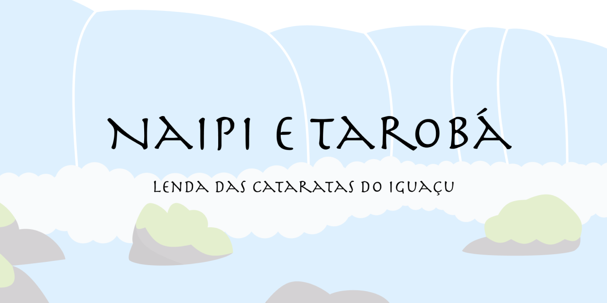

 # Naipi e Tarobá
 **Lenda das Cataratas do Iguaçu**

Este é um playground book em swift feito por Djenifer Renata Pereira e submetido ao WWDC21 Swift Challenge. Você pode ver o vídeo sobre o playgrounds no [youtube](https://youtu.be/NP4XIpNLOc4).

Se quiser, você pode mudar para a versão em inglês trocando a branch do repositório para **master**.

## Sobre a lenda

 Essa é uma história indígena brasileira, da tribo Kaingang.
 Ela é ensinada nas escolas do Paraná, um estado do sul do Brasil, mas não é bem conhecida mesma nessa região.

 > A tribo Kaingang é mais numerosa na parte sul do Brasil.

 A fim de espalhar a cultura brasileira e seu folclore,
 esse livro playground traz uma animação interativa contanto essa história.

## Créditos e Atribuições

A maioria dos sons usados nesse playground foram obtidos do Freesound.org e editados como permitido por suas licenças.

Sons sob [Creative Commons - CC0 1.0 Universal](http://creativecommons.org/publicdomain/zero/1.0/):
- ["Sabiá.wav"](https://freesound.org/people/Flavia2020/sounds/533411/) por Flavia2020
- ["Fish Splashing Pond.wav](https://freesound.org/people/kylecutsfilms/sounds/443380/)" por kylecutsfilms
- ["Paddles rowing on a calm water stream"](https://freesound.org/people/brunoboselli/sounds/249707/) por brunoboselli
- ["POOL SWIMMING R-L"](https://freesound.org/people/tbsounddesigns/sounds/530153/) por tbsounddesigns
- ["Cracking Earthquake (cracking soil, cracking stone)"](https://freesound.org/people/uagadugu/sounds/222521/) por uagadugu

Sons sob [Creative Commons - Attribution 3.0 Unported](http://creativecommons.org/licenses/by/3.0/):
- ["Waterfall, Small, A.wav"](https://freesound.org/people/InspectorJ/sounds/365915/) por InspectorJ (www.jshaw.co.uk)
- ["Waterfall, Large, A.wav"](https://freesound.org/people/InspectorJ/sounds/335992/) por InspectorJ (www.jshaw.co.uk)
- ["Small river.wav"](https://freesound.org/people/miguelpascucci/sounds/350480/) por miguelpascucci

"chocalho.mp3" criado por Guilerme Moreira Ribeiro Barciki, aluno da Apple Developer Academy - PUCPR, e pedido especialmente para este projeto. Foi cedido permissão para editar e criar outros trabalhos derivados.
